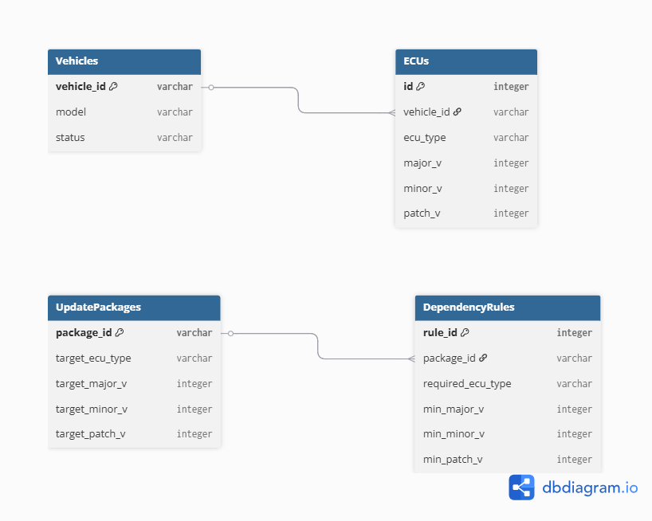

# OTA Deployment Dependency Validation System (SAP HANA)

> **SAP HANA 기반 OTA 배포 사전 검증 시스템**  
> ECU 간 소프트웨어 버전 의존성을 DB 레벨에서 검증하여  
> OTA 업데이트 실패(Brick)를 사전에 방지하는 관리 플랫폼

---

## Project Overview

차량 OTA(Over-The-Air) 업데이트에서 가장 치명적인 문제는  
**제어기(ECU) 간 버전 의존성 미검증으로 인한 업데이트 실패(Brick)** 입니다.

본 프로젝트는 현대자동차 SDV / OTA 환경을 가정하여,

- 특정 ECU를 업데이트하기 전에
- **다른 ECU들이 요구되는 최소 버전을 충족하는지**
- **SAP HANA DB 레벨에서 사전 검증**

하는 시스템을 구현하는 것을 목표로 합니다.

> OTA 배포 이전에 “이 차량은 업데이트 가능한 상태인가?”를  
> **Yes / No로 명확히 판단**하는 것이 핵심입니다.

---

## Key Goals

- ECU 간 **SW 버전 의존성 모델링**
- OTA 패키지 배포 가능 여부를 **DB에서 판단**
- Brick 방지를 위한 **사전 검증(Pre-condition Check)** 구조 설계
- SAP HANA 인메모리 DB의 **고속 조인 및 정합성 검증 활용**

---

## File Structure
```txt
ota-deployment-manager/
├─ .gitignore                 # 루트 위치 (Python, IDE, HANA 설정 제외)
├─ README.md                  # 프로젝트 개요 및 실행 방법
├─ requirements.txt           # hdbcli, Flask/FastAPI, pydantic 등
│
├─ db/                        # [HANA DB 영역]
│  ├─ src/
│  │  ├─ tables/
│  │  │  └─ ota_tables.hdbcds # 테이블 정의 (Vehicles, ECUs, Rules 등)
│  │  ├─ views/
│  │  │  └─ v_eligibility.sql # 배포 가능 여부 사전 계산 View
│  │  └─ data/
│  │      └─ sample_data.csv  # 초기 적재용 데이터
│  └─ schema.dbml             # dbdiagram.io 백업용 설계 파일
│
├─ backend/                   # [API 서버 영역]
│  ├─ .env.example            # HANA 접속 정보 템플릿 (HOST, PORT, UID, PWD)
│  ├─ app.py                  # 서버 진입점 (Flask 또는 FastAPI)
│  ├─ database.py             # hdbcli 기반 HANA 연결 세션 관리
│  ├─ dependency_check.py     # 핵심 로직 (DB View 호출 및 결과 가공)
│  └─ models.py               # Response 데이터 구조 정의 (Pydantic)
│
├─ frontend/                  # [대시보드 영역]
│  └─ dashboard/              # React/Vue 기반 UI
│     ├─ src/
│     │  ├─ components/       # 차량 상태, 업데이트 리스트 컴포넌트
│     │  └─ App.js            # API 연동 및 라우팅
│     └─ package.json
│
└─ scripts/                   # [유틸리티 스크립트]
   └─ populate_db.py          # hdbcli를 이용한 CSV 데이터 벌크 업로드
```
---

## Core Concept

### OTA 업데이트 실패 시나리오
- BMS ECU를 v3.0으로 업데이트
- 그러나 BCM ECU가 v2.0 이상이어야 정상 동작
- BCM이 v1.8인 상태에서 업데이트 → **Brick 발생**

-> **이 문제를 OTA 서버가 아닌 DB가 먼저 차단**

---

## Domain Model

본 프로젝트는 아래 4개의 핵심 도메인으로 구성됩니다.

- **Vehicle** : 차량 단위 정보
- **ECU** : 차량 내 제어기 및 현재 SW 버전
- **UpdatePackage** : OTA 업데이트 대상 패키지
- **DependencyRule** : ECU 간 버전 의존성 규칙

---

## ERD (Entity Relationship Diagram)

> OTA 업데이트 가능 여부 판단의 핵심 구조



### 주요 관계
- 하나의 Vehicle은 여러 ECU를 가짐 (1:N)
- 하나의 UpdatePackage는 여러 DependencyRule을 가짐 (1:N)
- DependencyRule은 “이 패키지를 적용하려면 어떤 ECU가 어떤 버전 이상이어야 하는가”를 정의

---

## Database Schema

### Vehicles (차량 마스터)
| Column | Type | Description |
|:--- |:--- |:--- |
| **vehicle_id** (PK) | VARCHAR | 차량 고유 식별자 (VIN 등) |
| model | VARCHAR | 차종 (예: IONIQ6, GV80) |
| status | VARCHAR | 차량 상태 (READY / UPDATING / ERROR) |

### ECUs (제어기 현황)
| Column | Type | Description |
|:--- |:--- |:--- |
| id (PK) | INTEGER | 식별자 (Auto Increment) |
| vehicle_id (FK) | VARCHAR | 소속 차량 ID |
| ecu_type | VARCHAR | 제어기 타입 (BMS, BCM, VCU 등) |
| **major_v** | INTEGER | 현재 SW 주 버전 |
| **minor_v** | INTEGER | 현재 SW 부 버전 |
| **patch_v** | INTEGER | 현재 SW 패치 버전 |

### UpdatePackages (신규 배포 패키지)
| Column | Type | Description |
|:--- |:--- |:--- |
| **package_id** (PK) | VARCHAR | OTA 패키지 ID |
| target_ecu_type | VARCHAR | 업데이트 대상 제어기 타입 |
| target_major_v | INTEGER | 목표 주 버전 |
| target_minor_v | INTEGER | 목표 부 버전 |
| target_patch_v | INTEGER | 목표 패치 버전 |

### DependencyRules (의존성 검증 규칙)
| Column | Type | Description |
|:--- |:--- |:--- |
| rule_id (PK) | INTEGER | 규칙 고유 ID |
| package_id (FK) | VARCHAR | 연결된 OTA 패키지 ID |
| required_ecu_type | VARCHAR | 선행 조건을 확인할 제어기 타입 |
| **min_major_v** | INTEGER | 요구되는 최소 주 버전 |
| **min_minor_v** | INTEGER | 요구되는 최소 부 버전 |
| **min_patch_v** | INTEGER | 요구되는 최소 패치 버전 |

---

## Core Logic: Update Eligibility Check

### Question
> “이 차량은 이 OTA 업데이트를 적용할 수 있는가?”

### Decision Flow
1. OTA 패키지에 정의된 DependencyRule 조회
2. 해당 차량의 ECU 현재 버전 조회
3. **현재 버전 < 최소 요구 버전**
    - Yes → ❌ INCOMPATIBLE
    - No → ✅ READY

### Result Example

| vehicle_id | package_id | eligibility |
|-----------|------------|-------------|
| V001 | PKG_001 | INCOMPATIBLE |

---

## Implementation Highlights

- **SAP HANA**
    - In-memory 기반 고속 조인
    - SQLScript / CDS View 활용
- **Validation Logic**
    - Application 레벨이 아닌 **DB 레벨 판단**
    - 데이터 정합성 중심 설계
- **State Management**
    - READY → PENDING → UPDATING
    - INCOMPATIBLE → BLOCKED

---

## OTA System Relevance

본 프로젝트는 OTA 시스템에서 다음과 같은 부분 이해를 돕기 위해 진행하였습니다.

### 1. Pre-condition Validation
- 업데이트 실행 전 차량 상태 및 ECU 버전 검증
- 업데이트 불가 차량 사전 차단

### 2. Safe OTA Deployment
- ECU 간 의존성 미충족으로 인한 Brick 방지
- OTA 서버의 판단 로직 단순화

### 3. SDV Platform 확장성
- 버전 규칙 추가만으로 새로운 ECU 대응 가능
- 정책 변경 시 코드 수정 없이 DB 규칙 변경

---

## Tech Stack

- **Database**: SAP HANA
- **Query / Logic**: SQL, SQLScript, CDS View
- **Optional API**: REST API or Stored Procedure
- **Visualization**: SAPUI5 / SQL Console

---

## Future Improvements

- 버전 비교 로직 정규화 (Semantic Versioning)
- 대규모 차량 Fleet 대상 Batch Validation
- OTA 이력 및 실패 로그 관리
- 실시간 텔레메틱스 파이프라인과 연계

---

## Author

- **Name**: 한지운
- **Program**: 현대오토에버 모빌리티 SW 스쿨 3기 (클라우드 트랙)
